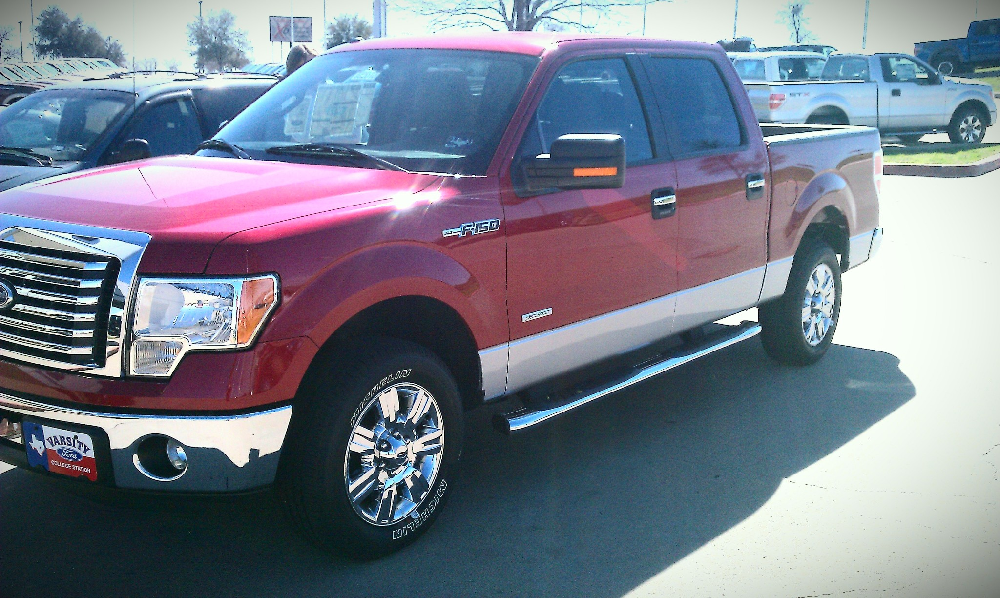

## Trucks (past and present)

<figure>
  
  <figcaption>My 2003 Ford F-250 with a 6.0 Powerstroke diesel engine.</figcaption>
</figure>

<figure>
  
  <figcaption>My 1986 Ford F-250 with a 460 CI big-block engine and a 4-speed transmission.</figcaption>
</figure>

<figure>
  
  <figcaption>My 2014 Ford F-150 ecoboost 4x4 in college, during a spring break trip to Mustang Island, TX. The truck had the 3.5L twin turbo ecoboost engine.</figcaption>
</figure>

<figure>
  
  <figcaption>My 2011 Ford F-150 ecoboost in college. The truck had the 3.5L twin turbo ecoboost engine.</figcaption>
</figure>

<figure>
  
  <figcaption>Texas A&amp;M AggieSpirit bus 109, taken in 2012 before my shift.</figcaption>
</figure>

<figure>
  
  <figcaption>My 2000 Ford F-150 parked on a dried lake bed near Lake Lewisville, TX. The truck had the 5.4L gas engine.</figcaption>
</figure>

<figure>
  
  <figcaption>Me driving a bread truck in 1994.</figcaption>
</figure>
